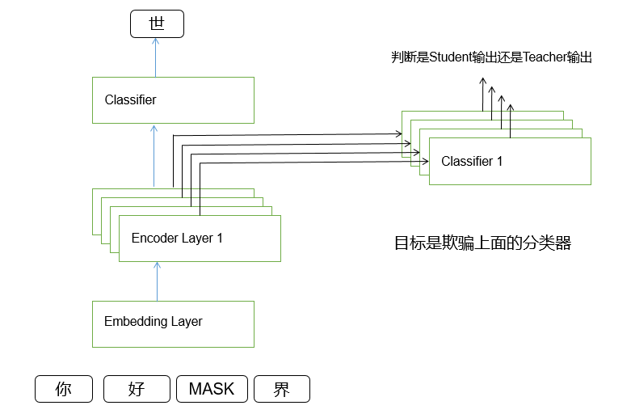

# KDABert: Knowledge Distillation with Generative Adversarial Networks for Bert Model Compression

[TOC]

## 模型架构图

## Methods
### Notations
- $L$: 学生层的transformer个数
- $l_i^s$: 学生模型第i层transformer
- $l_i^t$: 学生模型第i层transformer对应的教师模型的transformer
- $a_i^s$: $l_i^s$的attention score
- $a_i^t$: $l_i^t$的attention score
- $h_i^s$: $l_i^s$的hidden state
- $h_i^t$: $l_i^t$的hidden state
- $\mathcal{D}_{ia}$: 区分$a_i^s$和$a_i^t$的Discriminator
- $\mathcal{D}_{ih}$: 区分$h_i^s$和$h_i^t$的Discriminator

### Define Loss
$$L_{total}(\theta) = L(\theta) + \sum\limits_{i=1}^L \lambda^iL_{AD}^i$$
其中，$L_{total}(\theta)$是总的loss，$L(\theta)$是Student Model做MLM和NSP的loss，$L_{AD}^i$是$l_i^s$与$l_i^t$之间的对抗loss，$\lambda^i$是对$L_{AD}^i$加的权重。

对于$L(\theta)$，我们使用交叉熵计算损失。
$$L(\theta) = -\frac{1}{N}\sum\limits_{c=1}^{m}y_{ic}log\widehat{y}_{ic}$$
其中，$N$为样本数量，$c$为类别数目。

对于$L_{AD}^i$我们使用KL散度进行测量。
$$
L_{AD}^i(\theta) = \mathbb{E}_{a\sim P_{ai}^t}[logP_{ia}^d(a)] + \mathbb{E}_{a\sim P_{ai}^s}[log(1-P_{ia}^d(a))] \\
+ \mathbb{E}_{h\sim P_{hi}^t}[logP_{ih}^d(h)] + \mathbb{E}_{h\sim P_{hi}^s}[log(1-P_{ih}^d(h))]
$$

其中，$p_{ai}^t$是$a_i^t$的分布函数，$p_{ai}^s$是$a_i^s$的分布函数，$p_{ia}^{d}$是$\mathcal{D}_{ia}$输出概率的分布函数；$p_{hi}^t$是$h_i^t$的分布函数，$p_{hi}^s$是$h_i^s$的分布函数$p_{ih}^{d}$是$\mathcal{D}_{ih}$输出概率的分布函数。

### Training Objective
$$
\theta^{*} = \argmin_{\theta}(L(\theta) + \sum\limits_{i=1}^L\argmax_{\theta}L_{AD}^i)
$$
